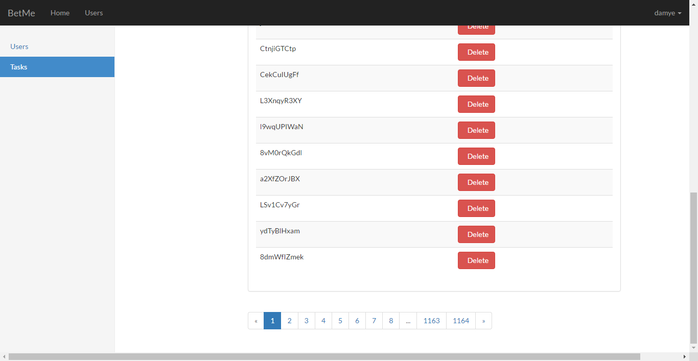

### About
A Laravel dashboard demo.


### Usage
+   clone this project
+   install composer( if composer has not been install )
+   run:
```bash
composer install
```
+   config database, file path: <code>config/database.php</code>, then run:
```bash
php artisan migrate
```
+   config Laravel enviroment( if .env file is not exisit ), run:
```bash
cp .env.example .env
php artisan key:generate
```
then, use this key in <code>.env</code>

### Tutorials(中文)
1. [Laravel后台系统实战（一）：安装](http://damye.github.io/2016/03/29/Laravel%E5%90%8E%E5%8F%B0%E7%B3%BB%E7%BB%9F%E5%AE%9E%E6%88%98%EF%BC%88%E4%B8%80%EF%BC%89%EF%BC%9A%E5%AE%89%E8%A3%85/)
2. [Laravel后台系统实战（二）：用户登录及管理](http://damye.github.io/2016/03/29/Laravel%E5%90%8E%E5%8F%B0%E7%B3%BB%E7%BB%9F%E5%AE%9E%E6%88%98%EF%BC%88%E4%BA%8C%EF%BC%89%EF%BC%9A%E7%94%A8%E6%88%B7%E7%99%BB%E5%BD%95%E5%8F%8A%E7%AE%A1%E7%90%86/)
3. [Laravel后台系统实战（三）：任务创建及管理](http://damye.github.io/2016/03/30/Laravel%E5%90%8E%E5%8F%B0%E7%B3%BB%E7%BB%9F%E5%AE%9E%E6%88%98%EF%BC%88%E4%B8%89%EF%BC%89%EF%BC%9A%E4%BB%BB%E5%8A%A1%E5%88%9B%E5%BB%BA%E5%8F%8A%E7%AE%A1%E7%90%86/)
4. [Laravel后台系统实战（四）：中间件应用之侧边栏选中](http://damye.github.io/2016/03/30/Laravel%E5%90%8E%E5%8F%B0%E7%B3%BB%E7%BB%9F%E5%AE%9E%E6%88%98%EF%BC%88%E5%9B%9B%EF%BC%89%EF%BC%9A%E4%B8%AD%E9%97%B4%E4%BB%B6%E5%BA%94%E7%94%A8%E4%B9%8B%E4%BE%A7%E8%BE%B9%E6%A0%8F%E9%80%89%E4%B8%AD/)